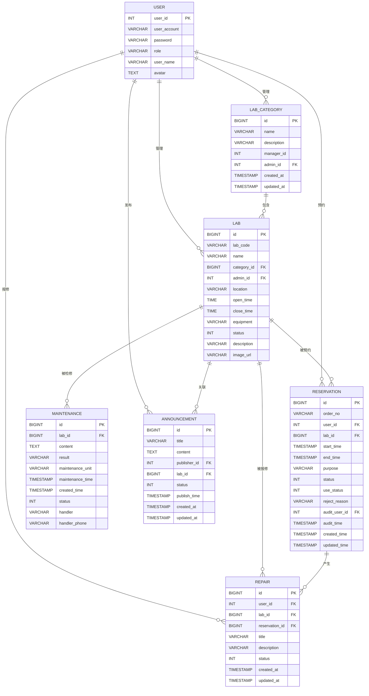

# 实验室管理系统数据库设计文档

## 1. 实体分析

### 1.1 核心实体识别

通过对系统代码分析，识别出以下核心实体：

1. **用户 (User)** - 系统用户基础信息
2. **实验室 (Lab)** - 实验室基本信息和配置
3. **实验室分类 (LabCategory)** - 实验室分类管理
4. **预约记录 (Reservation)** - 用户实验室预约信息
5. **报修记录 (Repair)** - 设备故障报修信息
6. **检修记录 (Maintenance)** - 设备检修处理记录
7. **公告 (Announcement)** - 系统公告信息

### 1.2 实体关系分析

- **用户 ↔ 实验室**: 一对多（一个管理员管理多个实验室）
- **用户 ↔ 预约记录**: 一对多（一个用户可以有多个预约）
- **用户 ↔ 报修记录**: 一对多（一个用户可以提交多个报修）
- **实验室 ↔ 预约记录**: 一对多（一个实验室可以有多个预约）
- **实验室 ↔ 报修记录**: 一对多（一个实验室可以有多个报修）
- **实验室 ↔ 检修记录**: 一对多（一个实验室可以有多个检修）
- **实验室分类 ↔ 实验室**: 一对多（一个分类包含多个实验室）
- **用户 ↔ 公告**: 一对多（一个用户可以发布多个公告）
- **实验室 ↔ 公告**: 一对多（一个实验室可以有多个公告）

## 2. ER图

## 3. 物理数据库设计

### 3.1 表结构设计

#### 3.1.1 用户表 (tb_user)

| 字段名 | 数据类型 | 长度 | 是否为空 | 默认值 | 约束 | 说明 |
|--------|----------|------|----------|--------|------|------|
| user_id | INT | - | NOT NULL | - | PRIMARY KEY, AUTO_INCREMENT | 用户ID |
| user_account | VARCHAR | 50 | NOT NULL | - | UNIQUE | 用户账号 |
| password | VARCHAR | 255 | NOT NULL | - | - | 密码 |
| role | VARCHAR | 20 | NOT NULL | - | - | 角色（学生/教师/实验室管理员/系统管理员） |
| user_name | VARCHAR | 50 | NULL | - | - | 用户姓名 |
| avatar | TEXT | - | NULL | - | - | 头像（Base64或URL） |

#### 3.1.2 实验室分类表 (lab_category)

| 字段名 | 数据类型 | 长度 | 是否为空 | 默认值 | 约束 | 说明 |
|--------|----------|------|----------|--------|------|------|
| id | BIGINT | - | NOT NULL | - | PRIMARY KEY, AUTO_INCREMENT | 分类ID |
| name | VARCHAR | 50 | NOT NULL | - | - | 分类名称 |
| description | VARCHAR | 255 | NULL | - | - | 分类描述 |
| manager_id | INT | - | NULL | - | - | 管理员ID |
| admin_id | INT | - | NULL | - | FOREIGN KEY | 分类管理员ID |
| created_at | TIMESTAMP | - | NULL | CURRENT_TIMESTAMP | - | 创建时间 |
| updated_at | TIMESTAMP | - | NULL | CURRENT_TIMESTAMP ON UPDATE | - | 更新时间 |

#### 3.1.3 实验室表 (lab)

| 字段名 | 数据类型 | 长度 | 是否为空 | 默认值 | 约束 | 说明 |
|--------|----------|------|----------|--------|------|------|
| id | BIGINT | - | NOT NULL | - | PRIMARY KEY, AUTO_INCREMENT | 实验室ID |
| lab_code | VARCHAR | 50 | NOT NULL | - | UNIQUE | 实验室编号 |
| name | VARCHAR | 100 | NULL | - | - | 实验室名称 |
| category_id | BIGINT | - | NOT NULL | - | FOREIGN KEY | 分类ID |
| admin_id | INT | - | NOT NULL | - | FOREIGN KEY | 管理员ID |
| location | VARCHAR | 100 | NULL | - | - | 位置 |
| open_time | TIME | - | NOT NULL | - | - | 开放时间 |
| close_time | TIME | - | NOT NULL | - | - | 关闭时间 |
| equipment | VARCHAR | 500 | NULL | - | - | 设备清单 |
| status | INT | - | NOT NULL | 1 | - | 状态（0-停用，1-正常，2-维护中） |
| description | VARCHAR | 255 | NULL | - | - | 描述 |
| image_url | VARCHAR | 255 | NULL | - | - | 图片URL |

#### 3.1.4 预约记录表 (reservation)

| 字段名 | 数据类型 | 长度 | 是否为空 | 默认值 | 约束 | 说明 |
|--------|----------|------|----------|--------|------|------|
| id | BIGINT | - | NOT NULL | - | PRIMARY KEY, AUTO_INCREMENT | 预约ID |
| order_no | VARCHAR | 32 | NOT NULL | - | UNIQUE | 预约单号 |
| user_id | INT | - | NOT NULL | - | FOREIGN KEY | 用户ID |
| lab_id | BIGINT | - | NOT NULL | - | FOREIGN KEY | 实验室ID |
| start_time | TIMESTAMP | - | NOT NULL | - | - | 开始时间 |
| end_time | TIMESTAMP | - | NOT NULL | - | - | 结束时间 |
| purpose | VARCHAR | 255 | NULL | - | - | 预约用途 |
| status | INT | - | NOT NULL | 0 | - | 预约状态（0-待审核，1-已通过，2-已拒绝，4-已取消） |
| use_status | INT | - | NOT NULL | 0 | - | 使用状态（0-待使用，1-使用中，2-已结束，4-已取消） |
| reject_reason | VARCHAR | 255 | NULL | - | - | 拒绝原因 |
| audit_user_id | INT | - | NULL | - | FOREIGN KEY | 审核人ID |
| audit_time | TIMESTAMP | - | NULL | - | - | 审核时间 |
| created_time | TIMESTAMP | - | NULL | CURRENT_TIMESTAMP | - | 创建时间 |
| updated_time | TIMESTAMP | - | NULL | CURRENT_TIMESTAMP ON UPDATE | - | 更新时间 |

#### 3.1.5 报修记录表 (repair)

| 字段名 | 数据类型 | 长度 | 是否为空 | 默认值 | 约束 | 说明 |
|--------|----------|------|----------|--------|------|------|
| id | BIGINT | - | NOT NULL | - | PRIMARY KEY, AUTO_INCREMENT | 报修ID |
| user_id | INT | - | NOT NULL | - | FOREIGN KEY | 报修人ID |
| lab_id | BIGINT | - | NOT NULL | - | FOREIGN KEY | 实验室ID |
| reservation_id | BIGINT | - | NULL | - | FOREIGN KEY | 关联预约ID |
| title | VARCHAR | 100 | NOT NULL | - | - | 报修标题 |
| description | VARCHAR | 500 | NULL | - | - | 报修描述 |
| status | INT | - | NOT NULL | 0 | - | 状态（0-待处理，1-处理中，2-已完成，3-已关闭） |
| created_at | TIMESTAMP | - | NULL | CURRENT_TIMESTAMP | - | 创建时间 |
| updated_at | TIMESTAMP | - | NULL | CURRENT_TIMESTAMP ON UPDATE | - | 更新时间 |

#### 3.1.6 检修记录表 (maintenance)

| 字段名 | 数据类型 | 长度 | 是否为空 | 默认值 | 约束 | 说明 |
|--------|----------|------|----------|--------|------|------|
| id | BIGINT | - | NOT NULL | - | PRIMARY KEY, AUTO_INCREMENT | 检修ID |
| lab_id | BIGINT | - | NOT NULL | - | FOREIGN KEY | 实验室ID |
| content | TEXT | - | NOT NULL | - | - | 检修内容 |
| result | VARCHAR | 255 | NOT NULL | - | - | 检修结果 |
| maintenance_unit | VARCHAR | 100 | NOT NULL | - | - | 检修单位 |
| maintenance_time | TIMESTAMP | - | NOT NULL | - | - | 检修时间 |
| created_time | TIMESTAMP | - | NOT NULL | CURRENT_TIMESTAMP | - | 创建时间 |
| status | INT | - | NOT NULL | 0 | - | 状态（0-处理中，1-已完成） |
| handler | VARCHAR | 50 | NOT NULL | - | - | 检修人 |
| handler_phone | VARCHAR | 20 | NOT NULL | - | - | 联系电话 |

#### 3.1.7 公告表 (announcement)

| 字段名 | 数据类型 | 长度 | 是否为空 | 默认值 | 约束 | 说明 |
|--------|----------|------|----------|--------|------|------|
| id | BIGINT | - | NOT NULL | - | PRIMARY KEY, AUTO_INCREMENT | 公告ID |
| title | VARCHAR | 100 | NOT NULL | - | - | 公告标题 |
| content | TEXT | - | NOT NULL | - | - | 公告内容 |
| publisher_id | INT | - | NOT NULL | - | FOREIGN KEY | 发布人ID |
| lab_id | BIGINT | - | NULL | - | FOREIGN KEY | 实验室ID |
| status | INT | - | NOT NULL | 0 | - | 状态（0-草稿，1-已发布，2-已撤回） |
| publish_time | TIMESTAMP | - | NULL | - | - | 发布时间 |
| created_at | TIMESTAMP | - | NULL | CURRENT_TIMESTAMP | - | 创建时间 |
| updated_at | TIMESTAMP | - | NULL | CURRENT_TIMESTAMP ON UPDATE | - | 更新时间 |

### 3.2 索引设计

#### 3.2.1 主键索引
- 所有表的主键字段自动创建聚簇索引

#### 3.2.2 唯一索引
- `tb_user.user_account` - 用户账号唯一性
- `lab.lab_code` - 实验室编号唯一性
- `reservation.order_no` - 预约单号唯一性

#### 3.2.3 外键索引
- `lab.category_id` - 加速分类查询
- `lab.admin_id` - 加速管理员查询
- `reservation.user_id` - 加速用户预约查询
- `reservation.lab_id` - 加速实验室预约查询
- `repair.user_id` - 加速用户报修查询
- `repair.lab_id` - 加速实验室报修查询
- `maintenance.lab_id` - 加速实验室检修查询
- `maintenance.repair_id` - 加速报修关联查询

#### 3.2.4 业务索引
- `reservation.start_time, reservation.end_time` - 时间范围查询
- `reservation.status` - 状态筛选
- `reservation.use_status` - 使用状态筛选
- `repair.status` - 报修状态筛选
- `maintenance.status` - 检修状态筛选
- `announcement.status` - 公告状态筛选
- `announcement.publish_time` - 发布时间排序

### 3.3 数据类型选择

#### 3.3.1 整数类型
- `INT`: 用户ID、状态码等小范围整数
- `BIGINT`: 主键ID、时间戳等大范围整数

#### 3.3.2 字符串类型
- `VARCHAR`: 固定长度文本，如名称、编号
- `TEXT`: 长文本内容，如描述、内容、头像

#### 3.3.3 时间类型
- `TIMESTAMP`: 带时区的精确时间，用于记录创建/更新时间
- `TIME`: 时间部分，用于开放/关闭时间
- `DATETIME`: 不带时区的日期时间，用于业务时间

### 3.4 约束设计

#### 3.4.1 非空约束
- 主键字段：NOT NULL
- 业务必需字段：NOT NULL
- 可选字段：NULL

#### 3.4.2 默认值约束
- 状态字段：设置合理默认值
- 时间字段：CURRENT_TIMESTAMP
- 更新时间：ON UPDATE CURRENT_TIMESTAMP

#### 3.4.3 外键约束
- 确保数据引用完整性
- 设置级联更新策略
- 考虑级联删除策略

### 3.5 存储引擎选择

- 推荐使用 **InnoDB** 存储引擎
- 支持事务、外键、行级锁
- 适合高并发场景

### 3.6 字符集和排序规则

- 字符集：`utf8mb4`
- 排序规则：`utf8mb4_unicode_ci`
- 支持完整的Unicode字符集，包括emoji

## 4. 数据库优化建议

### 4.1 查询优化
1. 合理使用索引，避免全表扫描
2. 使用覆盖索引减少回表操作
3. 避免在WHERE子句中使用函数
4. 合理使用分页查询

### 4.2 存储优化
1. 大文本字段使用TEXT类型
2. 图片等二进制数据考虑文件存储
3. 定期清理历史数据
4. 使用分区表处理大数据量

### 4.3 安全优化
1. 敏感字段加密存储
2. 定期备份数据
3. 设置合理的用户权限
4. 启用审计日志

### 4.4 监控优化
1. 监控慢查询日志
2. 定期分析表统计信息
3. 监控数据库连接数
4. 设置合理的缓存策略
